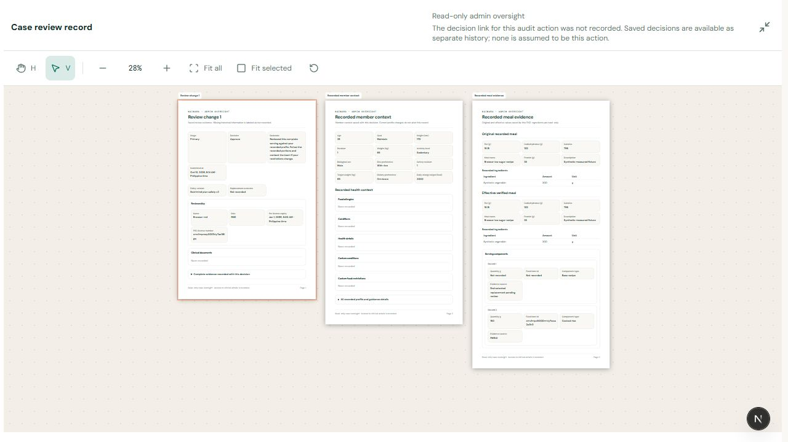
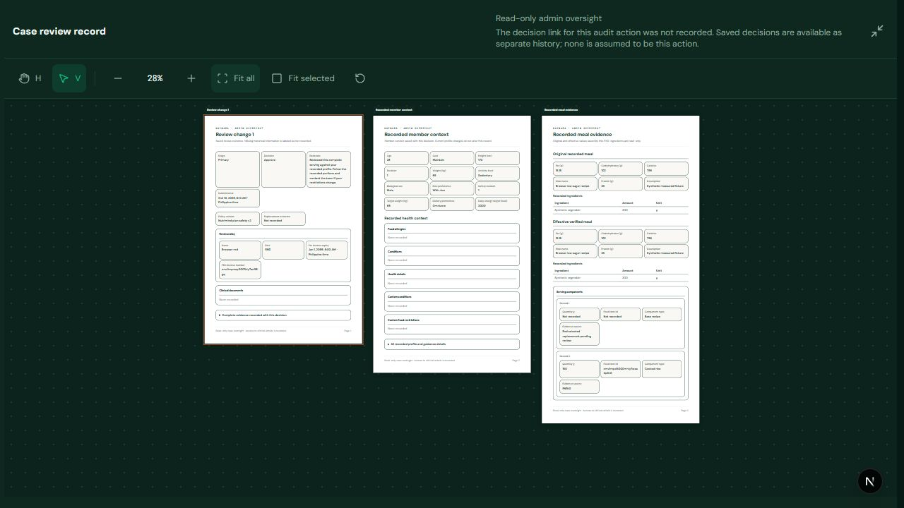
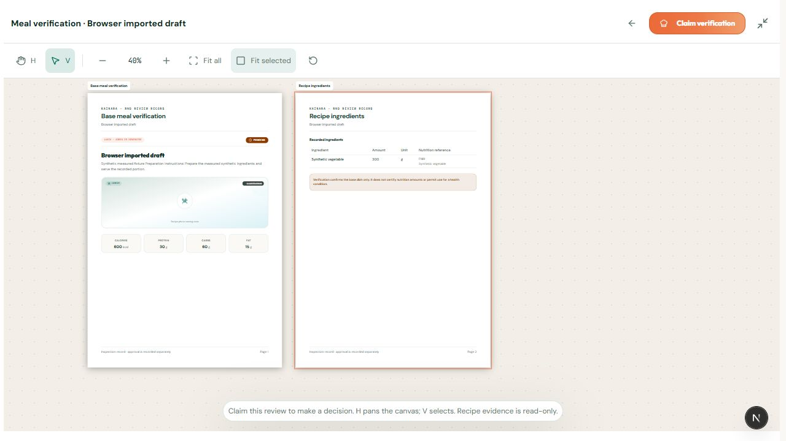

# Admin canvas and cross-role UI verification — October 10, 2026

## Changes

- Admin related-case oversight now uses the existing RND `ReviewCanvas` and paper sheets. Decision history remains in an external selector; recorded member context and original/effective meal evidence appear beside the decision. Ingredient amounts and units are separate read-only cells. Full evidence remains available through expandable sections that mount only when opened. Live member details remain explicitly separate.
- Admin mode omits the RND decision dock and claim prompt. H/V, movable sheets, local zoom, fit controls and true fullscreen reuse the same implementation. An oversized evidence sheet no longer positions shorter sheets above the visible viewport.
- New approval, rejection and dispute audit events record their immutable decision ID. Case context selects only a decision belonging to that plan. Older events without this link explicitly report the missing association; available decisions remain selectable history, without assuming the latest decision belongs to the chosen event. No historical backfill or migration was performed.
- Case opens reject malformed response shapes, suppress duplicate synchronous requests and discard superseded owner/case requests. Related-file errors stay visible inside fullscreen. Sensitive reads still require explicit opening of related details and retain server-side case relationships and access auditing.
- Recorded fields use light paper colors inside the canvas in either portal theme. RND stays capitalized and internal linkage fields are hidden in the presentation.
- RND base verification previously omitted ingredient data sources and composition names from its DTO. Library and generated recipe projections now retain recorded sources and actual mapped names; unknown values remain unknown. The browser confirmed a mapped synthetic FNRI ingredient that previously appeared as “Not recorded.”

## Verification

Actual password-authenticated admin and RND browser sessions used the existing task-owned loopback database `kainara_browser_full_20261010_v3`, API 5002 and frontend 3002. It contains ten synthetic accounts and all 103 migrations; external providers are disabled. Normal localhost 3000/API 5000 and shared Neon were preserved.

Interactive checks covered:

- Admin RND approval history, related-context access, three movable sheets, original/effective plate values, separate live profile selection contract, fullscreen dimensions (1280 × 720 equals the browser viewport), H/V, keyboard sheet movement, fit controls and both themes. No clinical decision dock appeared for admin.
- Recipe flag audit with all 11 saved changes, third-incident quarantine and recorded notes; recipe-wide oversight did not expose a member profile.
- Admin subscription and meal-log views with their expected empty fixture states. The earlier member dashboard session retained its existing approval and missing-slot notices, and member access to an admin URL was denied.
- RND queue clear state and an imported recipe's two-sheet verification preview. Its mapped ingredient showed FNRI and its recorded composition name. The RND claim requirement and fullscreen decision dock remained present. Inspected admin/RND browser error logs were empty.

Automated results: **889 backend tests passed**, zero failed, one existing TODO (890 total); **880 frontend component tests across 187 files** and **eight frontend Node checks** passed. Backend/frontend lint and production builds passed. The global source architecture guard and all 21 entry-point budgets passed. Added service regressions cover older linked decisions, legacy/unrelated decision IDs, admin authorization, related evidence scoping/access recording and ingredient provenance. UI regressions cover selected history, read-only sheets/tables, malformed and duplicate opens, fullscreen download errors, missing values and exceptionally long sheets. Existing member/RND workflows ran in the full suites.

One full run exposed an existing test race: quarantine confirmation was clicked as soon as the claim request started, before the refreshed UI enabled confirmation. The test now waits for that prerequisite. The targeted regression and full run with two workers passed; no application authorization or claim gate was weakened.

## Evidence and limits

This round did not repeat every earlier destructive governance journey or test real provider delivery, load, hosted deployment or clinical validity. Legacy missing snapshot/decision associations remain explicit. No shared migration application, clarification enablement or demo promotion occurred. Unrelated checkout edits remain outside this change.
